---
## Front matter
lang: ru-RU
title: Лабораторная работа №1
subtitle: Имитационное моделирование
author:
  - Лисенков Е.Р.
institute:
  - Российский университет дружбы народов, Москва, Россия

## i18n babel
babel-lang: russian
babel-otherlangs: english

## Formatting pdf
toc: false
toc-title: Содержание
slide-level: 2
aspectratio: 169
section-titles: true
theme: metropolis

# Явно указываем движок здесь тоже для гарантии
pdf-engine: pdflatex

header-includes:
 - \metroset{progressbar=frametitle,sectionpage=progressbar,numbering=fraction}
 - '\makeatletter'
 - '\beamer@ignorenonframefalse'
 - '\makeatother'
 # УДАЛИТЕ \usepackage[russian]{babel} — он загружается автоматически через babel-lang!
 # Оставьте только пакеты кодировки для pdflatex:
 - \usepackage[T2A]{fontenc}
 - \usepackage[utf8]{inputenc}
---

# Информация

## Докладчик

:::::::::::::: {.columns align=center}
::: {.column width="70%"}

  * Лисенков Егор Романович
  * студент
  * Российский университет дружбы народов
  * [1132232881@rudn.ru](mailto:1132232881@rudn.ru)
  * <https://github.com/erlisenkov>

:::
::: {.column width="30%"}

:::
::::::::::::::

# Вводная часть

## Актуальность

Актуальность лабораторной работы обусловлена необходимостью освоения современных стандартов вычислительной науки, обеспечивающих воспроизводимость и прозрачность исследований. Применение методологии DrWatson.jl и литературного программирования (Literate.jl) позволяет автоматизировать рутинные процессы организации данных, версионирования параметров и генерации отчётов, исключая ошибки ручного копирования. Интеграция инженерных практик (SemVer, Gitflow, Conventional Commits) в научную работу формирует культуру разработки, соответствующую требованиям FAIR-принципов управления данными, что критически важно для верификации результатов и долгосрочной поддержки научных проектов.

## Объект и предмет исследования

DrWatson.jl и литературного программирования (Literate.jl) позволяет автоматизировать рутинные процессы организации данных, версионирования параметров и генерации отчётов, исключая ошибки ручного копирования. Интеграция инженерных практик (SemVer, Gitflow, Conventional Commits) в научную работу формирует культуру разработки, соответствующую требованиям FAIR-принципов управления данными, что критически важно для верификации результатов и долгосрочной поддержки научных проектов.

## Цели и задачи

- Научиться работать с DrWatson.jl и Julia

## Материалы и методы

- Курс Имитационное моделирование ТУИС

## Активация проекта DrWatson
Активировано изолированное окружение проекта для гарантии воспроизводимости и изоляции версий пакетов.
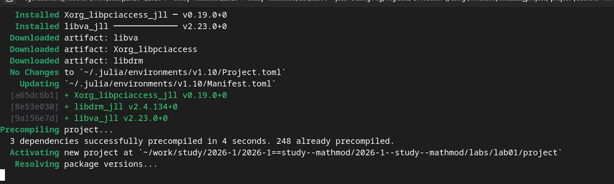{#fig:001 width=100%}

## Установка базовых пакетов
Установлены 10 ключевых пакетов (DrWatson, DifferentialEquations, Plots, Literate) согласно п. 1.9.2 методички.
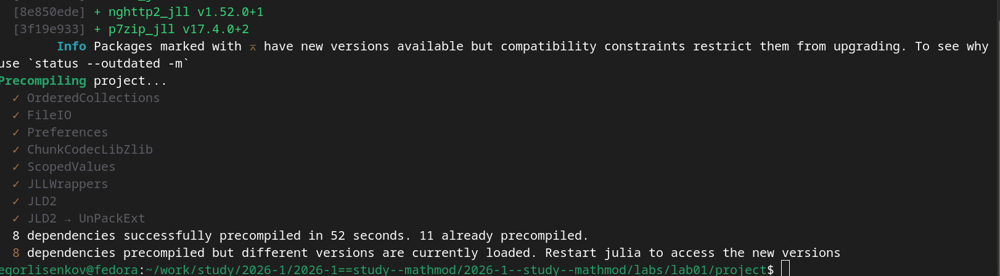{#fig:002 width=100%}

## Загрузка системных артефактов
Автоматически загружены низкоуровневые библиотеки MKL и Xorg для ускорения вычислений и рендеринга графиков.
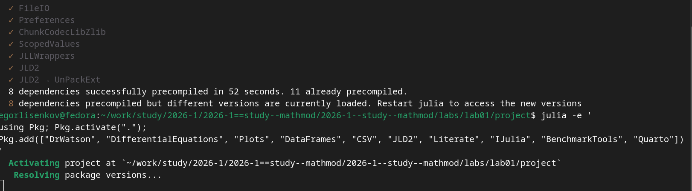{#fig:003 width=100%}

## Прекомпиляция тяжёлых модулей
Начата прекомпиляция сложных научных пакетов (PureKLU, IJulia) с прогрессом 156/269 этапов.
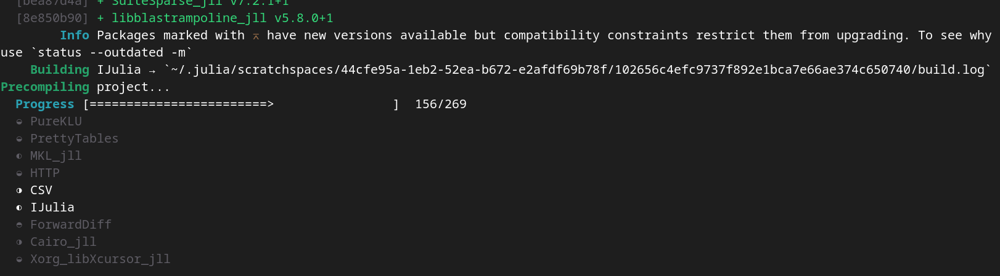{#fig:004 width=100%}

## Финализация прекомпиляции
Сборка завершена успешно: 248 зависимостей из кэша, 3 новых скомпилированы за 4 секунды.
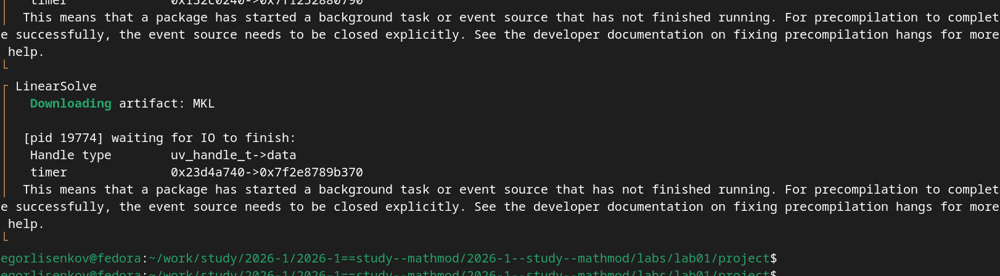{#fig:005 width=100%}

## Создание и редактирование скрипта
Создан литературный скрипт 01_exponential_growth.jl с Markdown-комментариями согласно п. 1.10.3.1.
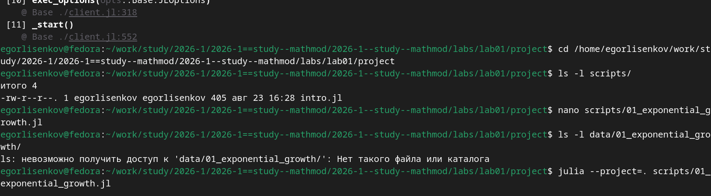{#fig:006 width=100%}

## Первый запуск модели
Модель выполнена корректно: аналитическое время удвоения при $\alpha=0.3$ составило 2.31.
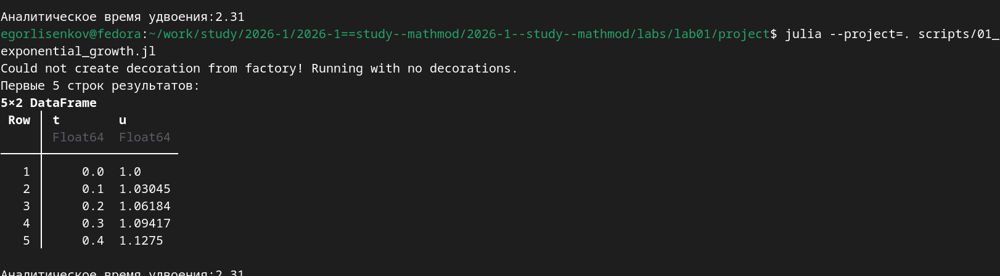{#fig:007 width=100%}

## Генерация производных форматов Tangle
Утилита tangle.jl автоматически создала чистый код, Quarto-документ и Jupyter Notebook из одного источника.
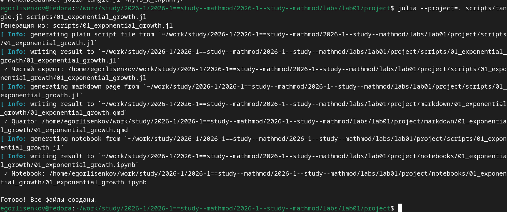{#fig:008 width=100%}

## Результаты базового эксперимента
Результаты одиночного запуска кэшированы в .jld2 файле с уникальным именем на основе параметров.
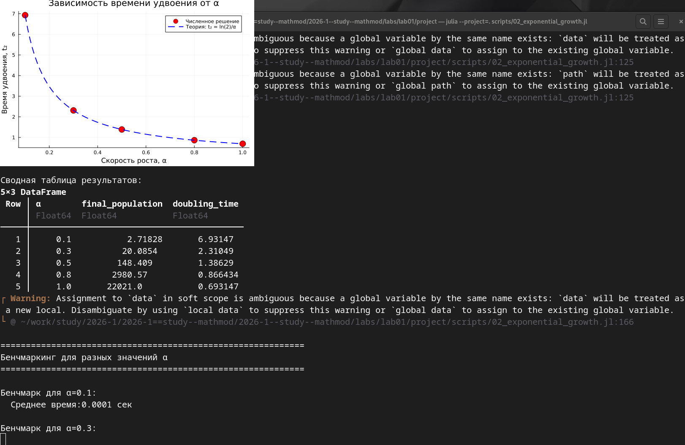{#fig:009 width=100%}

## Результаты параметрического сканирования
Сохранены 5 изолированных файлов результатов для значений $\alpha \in \{0.1, 0.3, 0.5, 0.8, 1.0\}$.
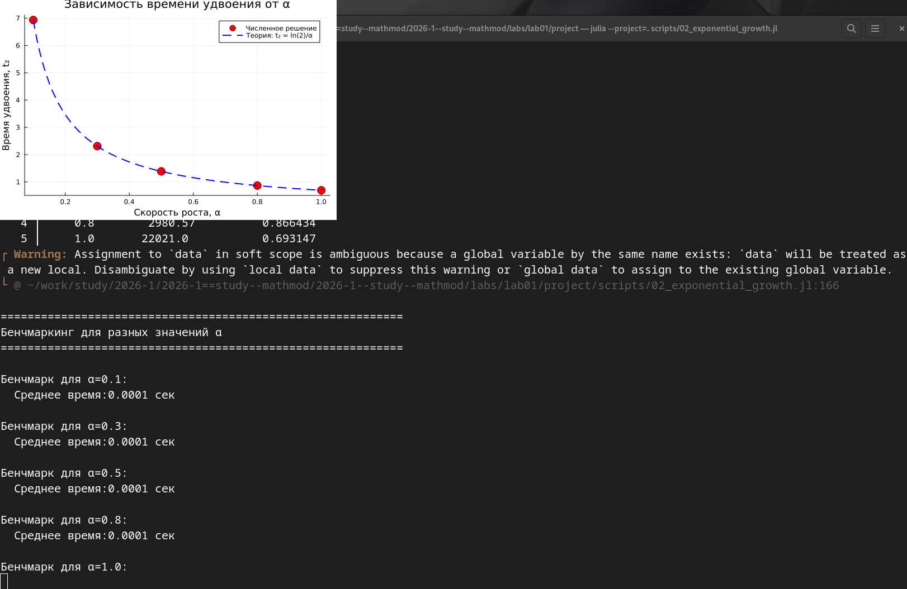{#fig:010 width=100%}

## Сгенерированные графики
Созданы 4 визуализации: базовая модель, сравнение траекторий, время удвоения и бенчмарк.
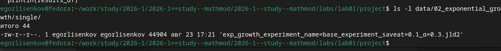{#fig:011 width=100%}

## Сводные данные и объекты графиков
Агрегированные результаты и объекты графиков сериализованы в JLD2 для повторного использования без пересчёта.
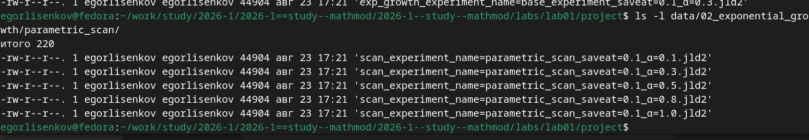{#fig:012 width=100%}

## Генерация форматов для второго скрипта
Литературный скрипт 02_exponential_growth.jl успешно преобразован во все три целевых формата.
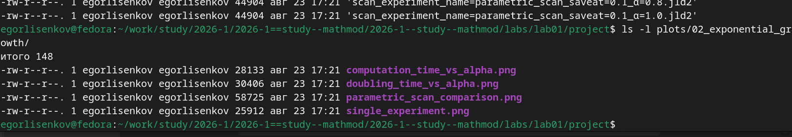{#fig:013 width=100%}

## Чистый код скрипта
Извлечён автономный исполняемый файл .jl размером 9682 байта без Markdown-разметки.
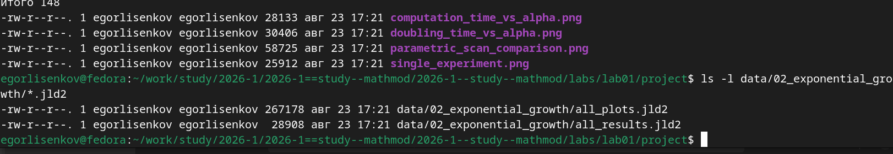{#fig:014 width=100%}

## Quarto документ
Сгенерирован .qmd файл для интеграции описания параметрического исследования в итоговый отчёт.
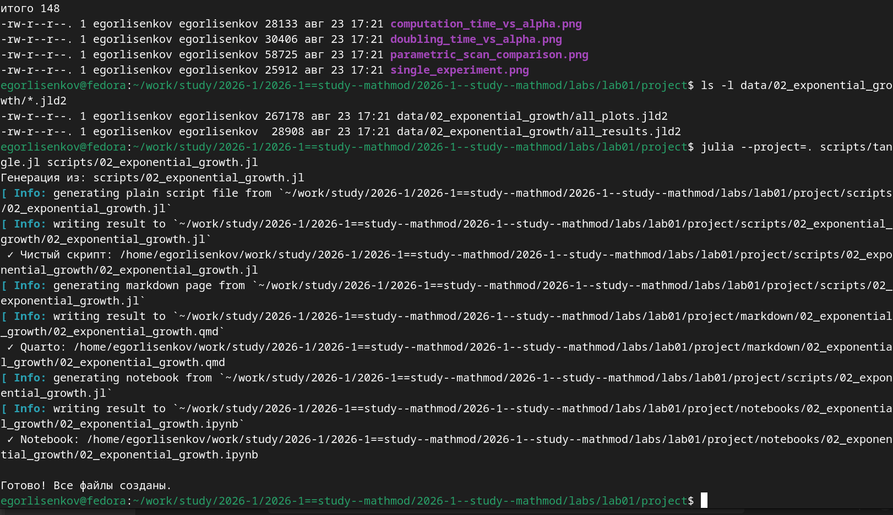{#fig:015 width=100%}

## Jupyter Notebook
Создан интерактивный ноутбук .ipynb для пошагового исследования модели в браузере.
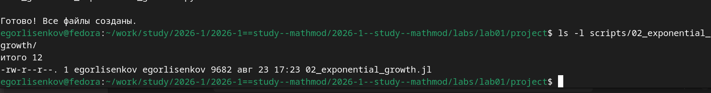{#fig:016 width=100%}

## Запуск ноутбука ячейки 1-5
Инициализирована среда DrWatson, определена модель и настроены базовые параметры эксперимента.
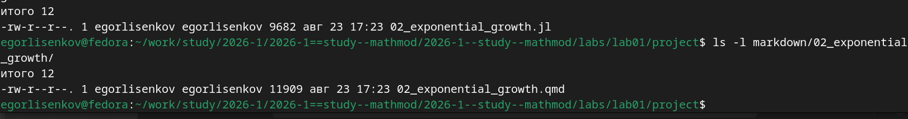{#fig:017 width=100%}

## Выполнение базового эксперимента в ноутбуке
Получено численное решение ОДУ и построен график экспоненциального роста популяции.
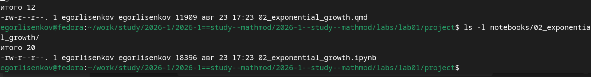{#fig:018 width=100%}

## Визуализация зависимости времени удвоения
Численные точки идеально совпали с теоретической кривой $T_2 = \ln(2)/\alpha$, подтверждая точность решателя.
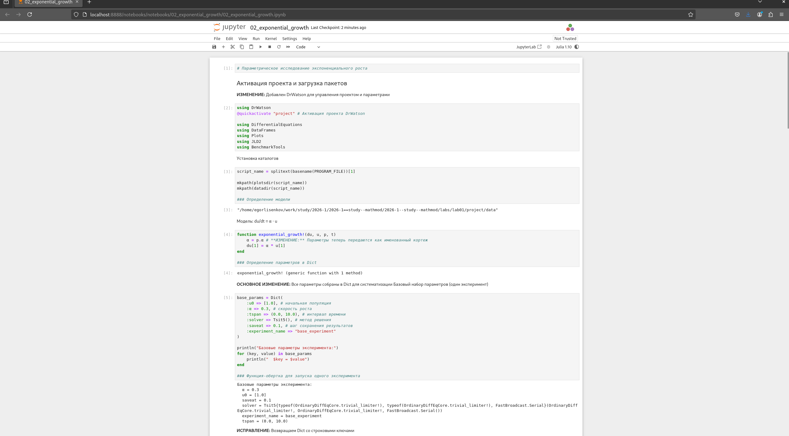{#fig:019 width=100%}

## Параметрическое сканирование и анализ
Данные загружены из кэша через produce_or_load и собраны в сводную таблицу DataFrame.
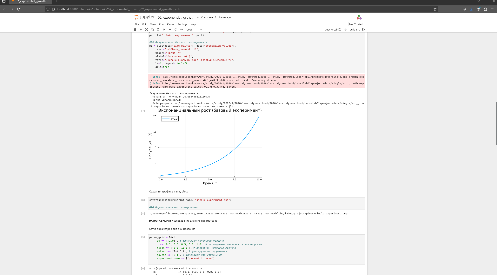{#fig:020 width=100%}

## Бенчмаркинг производительности решателя
Среднее время решения ОДУ стабильно составляет ~0.0001 сек независимо от значения параметра $\alpha$.
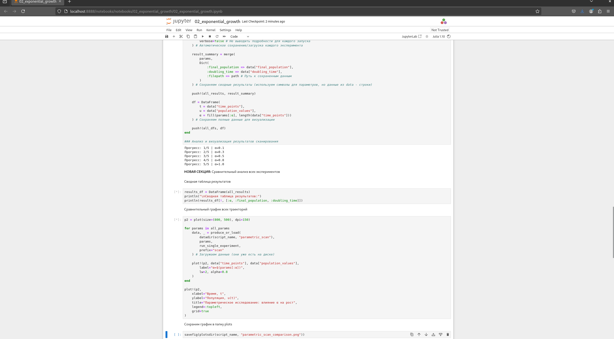{#fig:021 width=100%}

## Финальное сохранение артефактов
Все результаты и метаданные сериализованы в JLD2, работа завершена сообщением об успехе.
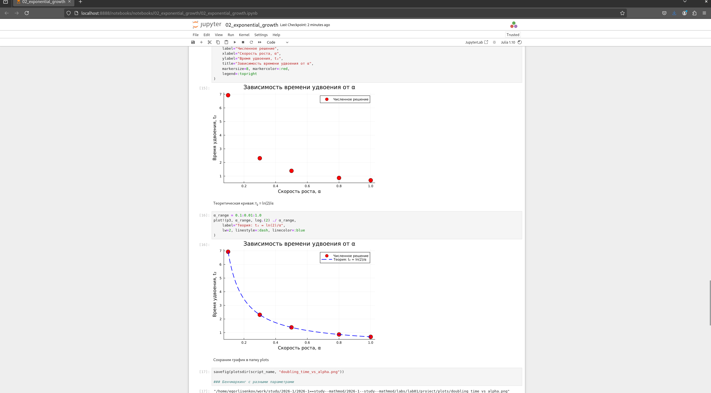{#fig:022 width=100%}

## Настройка конфигурации Quarto
В _quarto.yml добавлен движок Julia и путь к проекту для корректной компиляции отчёта.
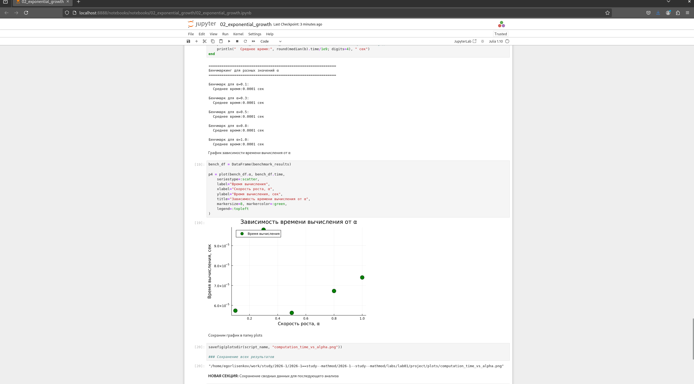{#fig:023 width=100%}

## Компиляция отчёта Quarto
Отчёт успешно скомпилирован командой quarto render с интеграцией всех включаемых документов.
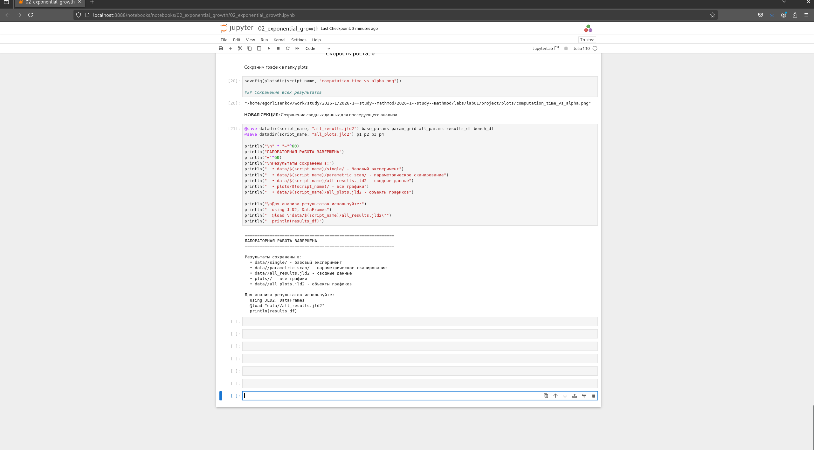{#fig:024 width=100%}

## Результат

## Результаты лабораторной работы

В ходе выполнения лабораторной работы №1 успешно реализована модель экспоненциального роста с соблюдением методологии воспроизводимых научных исследований на языке Julia.

## Итоговый слайд

Успешно настроено изолированное окружение в Fedora Linux с применением инженерных практик (SemVer, Conventional Commits, Gitflow, Denote) для обеспечения воспроизводимости исследований.

