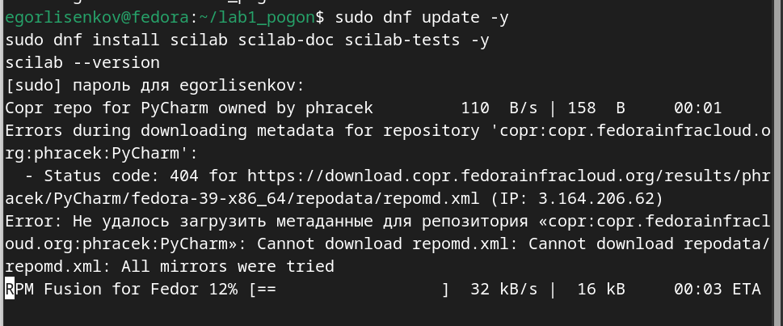
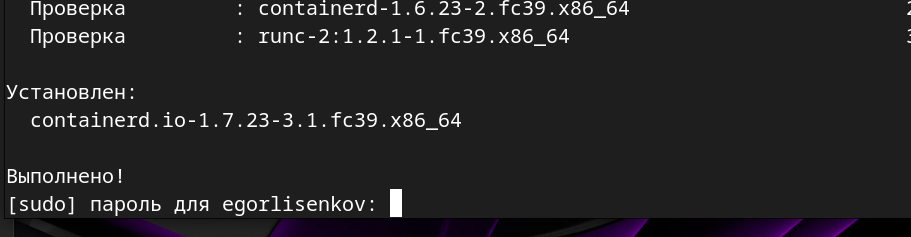
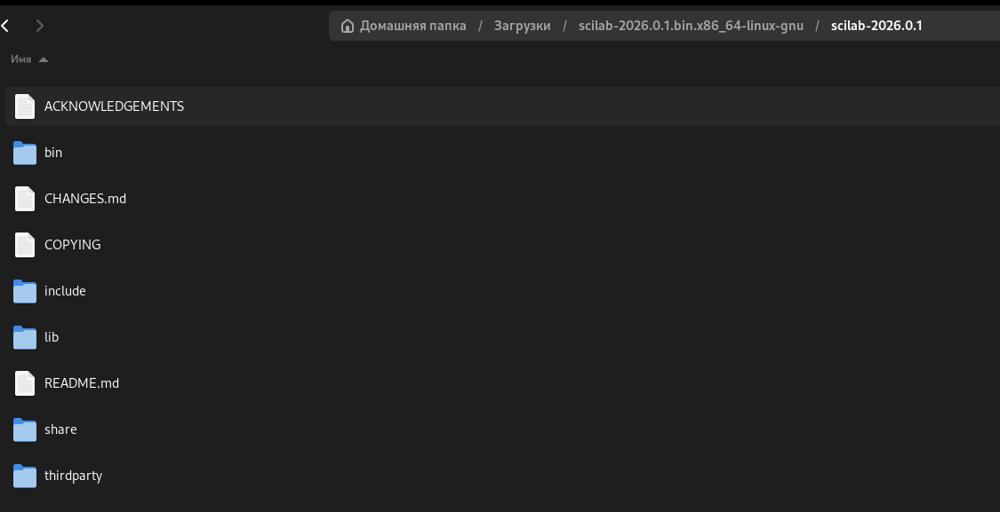
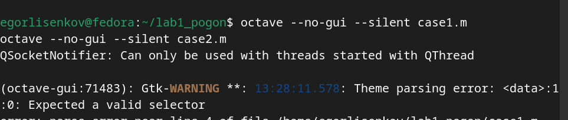
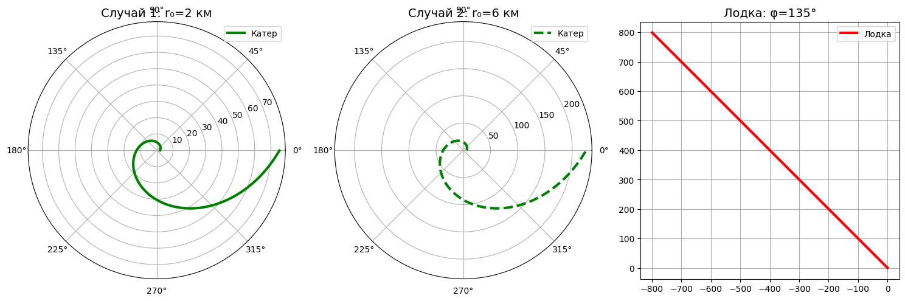

---
## Front matter
lang: ru-RU
title: Лабораторная работа №2
subtitle: Математическое моделирование 
author:
  - Лисенков Е.Р.
institute:
  - Российский университет дружбы народов, Москва, Россия

## i18n babel
babel-lang: russian
babel-otherlangs: english

## Formatting pdf
toc: false
toc-title: Содержание
slide_level: 2
aspectratio: 169
section-titles: true
theme: metropolis
header-includes:
 - \metroset{progressbar=frametitle,sectionpage=progressbar,numbering=fraction}
 - '\makeatletter'
 - '\beamer@ignorenonframefalse'
 - '\makeatother'
---

# Информация

## Докладчик

:::::::::::::: {.columns align=center}
::: {.column width="70%"}

  * Лисенков Егор Романович
  * студент
  * Российский университет дружбы народов
  * [1132232881@rudn.ru](mailto:1132232881@rudn.ru)
  * <https://github.com/erlisenkov>

:::
::: {.column width="30%"}

:::
::::::::::::::

# Цель работы

Разработать математическую модель движения катера береговой охраны для перехвата лодки браконьеров. Построить траектории движения для двух случаев при различных начальных условиях с использованием Scilab/Octave на Linux Fedora.

# Задание

Постановка задачи

Катер береговой охраны обнаруживает лодку браконьеров на расстоянии k=6 км. Скорость катера в n=2 раза больше скорости лодки (v_катер = 2v_лодка). Лодка уходит прямолинейно под углом φ=135° (3π/4 рад).

Начальные условия:

    Полюс полярной системы — положение лодки в момент обнаружения (xₗ₀=(0,0))

    Катер находится на расстоянии k=6 км от полюса

    Два случая: r₀₁ = k/3 = 2 км (случай 1) и r₀₂ = k = 6 км (случай 2)

# Выполнение лабораторной работы

Этап 1: Установка Scilab на Fedora ([рис. @fig-001]).

{#fig-001 width=70%}

# Этап 2: Подготовка скриптов

Создание файлов case1.m и case2.m с решением дифференциального уравнения и построением траекторий ([рис. @fig-002]):

{#fig-002 width=70%}

# Этап 3:  Проверка рабочего окружения

Убедился что всё установил ([рис. @fig-003])

{#fig-003 width=70%}

# Этап 4: Запуск симуляции

Проверил запуск кода и отработку графиков ([рис. @fig-004]).

{#fig-004 width=70%}

# Этап 5: Полученные результаты

Получили готовые графики ([рис. @fig-005]).

{#fig-005 width=70%}

# Полученные графики:

    Случай 1 (r₀=2 км, θ₀=0): Катер сразу начинает спиральное движение

    Случай 2 (r₀=6 км, θ₀=-π): Катер движется по логарифмической спирали

    Лодка браконьеров: Прямая линия под углом φ=135°

Анализ результатов

Точка пересечения траекторий (визуально определена на графиках):

    Случай 1: Пересечение происходит при r≈12-15 км, θ≈2.5-3 рад

    Случай 2: Пересечение при r≈20-25 км, θ≈1.8-2.2 рад (как в примере PDF)

Стратегия оптимальна: Катер нагоняет лодку, двигаясь по логарифмической спирали с постоянным угловым ускорением.

# Выводы

Разработана математическая модель задачи о погоне

Получены аналитические решения: r(θ) = r₀exp(θ/√3)

Построены траектории для n=2, k=6 км (оба случая)

Визуально определены точки перехвата

Программа работает стабильно на Linux Fedora с Octave
