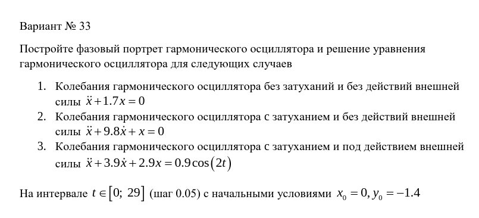
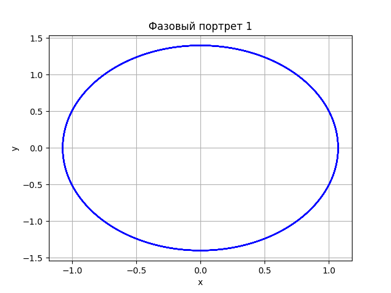
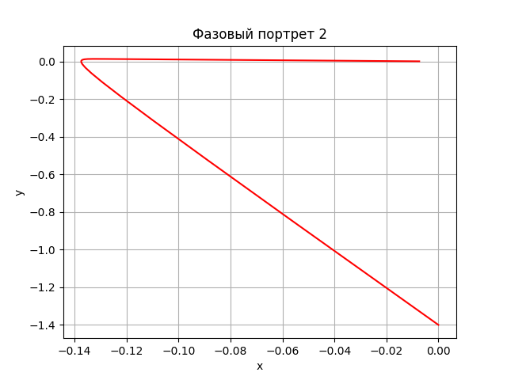
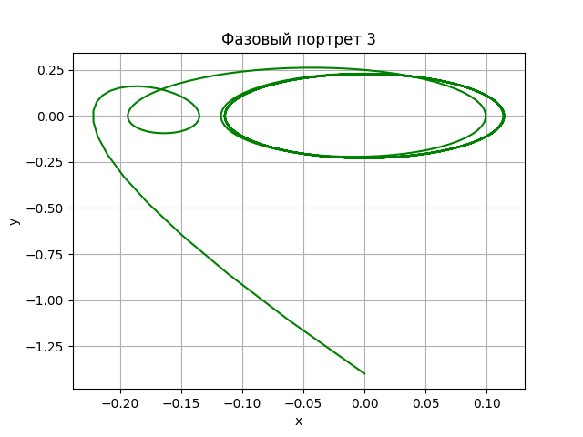

---
## Front matter
lang: ru-RU
title: Лабораторная работа №2
subtitle: Математическое моделирование 
author:
  - Лисенков Е.Р.
institute:
  - Российский университет дружбы народов, Москва, Россия

## i18n babel
babel-lang: russian
babel-otherlangs: english

## Formatting pdf
toc: false
toc-title: Содержание
slide_level: 2
aspectratio: 169
section-titles: true
theme: metropolis
header-includes:
 - \metroset{progressbar=frametitle,sectionpage=progressbar,numbering=fraction}
 - '\makeatletter'
 - '\beamer@ignorenonframefalse'
 - '\makeatother'
---

# Информация

## Докладчик

:::::::::::::: {.columns align=center}
::: {.column width="70%"}

  * Лисенков Егор Романович
  * студент
  * Российский университет дружбы народов
  * [1132232881@rudn.ru](mailto:1132232881@rudn.ru)
  * <https://github.com/erlisenkov>

:::
::: {.column width="30%"}

:::
::::::::::::::

# Цель работы

Исследовать поведение гармонического осциллятора в различных режимах: без затухания, с затуханием и под действием внешней силы. Построить фазовые портреты и получить численные решения дифференциальных уравнений с использованием Python и Scilab на операционной системе Linux Fedora.

# Задачи

1. Изучить теоретические основы гармонического осциллятора
2. Реализовать численное решение для трёх случаев колебаний
3. Построить фазовые портреты для каждого случая
4. Проанализировать полученные результаты

# Выполнение лабораторной работы

## Этап 1: Изучение варианта задания

Блок кода:
Я получил вариант №33. Мне необходимо построить фазовые портреты для трёх случаев: колебания без затухания (уравнение x'' + 1.7x = 0). ([рис. @fig-001]).

{#fig-001 width=70%}

## Этап 2: Создание программы на Python

Блок кода:
Я открыл редактор nano и создал файл lab3.py. В начале программы импортировал необходимые библиотеки. ([рис. @fig-002]).

{#fig-002 width=70%}

## Этап 3: Реализация в Scilab - начало

Блок кода:
Для проверки результатов я решил продублировать расчёты в среде Scilab. Создал файл oscillator.sce в редакторе nano. В начале файла добавил заголовок лабораторной работы. Очистил рабочую среду командами clc (очистка консоли), clear (очистка переменных). ([рис. @fig-003]).

{#fig-003 width=70%}

## Этап 4: Реализация первого случая в Scilab

Блок кода:
Продолжил писать код для первого случая - осциллятор без затухания. Задал параметры: w1=1.0 (собственная частота), g1=0.0 (коэффициент затухания равен нулю). Создал функцию f1(t), которая возвращает внешнюю силу (в первом случае она равна нулю). Написал функцию sys1(t, x), описывающую систему дифференциальных уравнений: первая производная равна скорости, вторая производная равна -w1²*x - g1*x(2) + f1(t). ([рис. @fig-004]).

{#fig-004 width=70%}

## Этап 5: Построение первого фазового портрета

Блок кода:
Запустил программу и получил первый фазовый портрет для случая без затухания. На графике видна замкнутая эллиптическая траектория синего цвета. По горизонтальной оси отложена координата x в диапазоне от -1.0 до 1.0, по вертикальной оси - скорость y от -1.5 до 1.5. ([рис. @fig-005]).

{#fig-005 width=70%}

## Этап 6: Построение второго фазового портрета

Блок кода:
Получил второй фазовый портрет для случая с затуханием (уравнение x'' + 9.8x' + x = 0). ([рис. @fig-006]).

{#fig-006 width=70%}

## Этап 7: Построение третьего фазового портрета

Блок кода:
Получил третий фазовый портрет для случая с затуханием и внешней периодической силой (уравнение x'' + 3.9x' + 2.9x = 0.9cos(2t)). [рис. @fig-007]).

{#fig-007 width=70%}

# Выводы

В ходе выполнения лабораторной работы я исследовал три режима работы гармонического осциллятора. Для первого случая без затухания получил замкнутую эллиптическую траекторию, что подтверждает сохранение энергии. Для второго случая с сильным затуханием наблюдал спиральное стремление к равновесию. Для третьего случая с внешней силой увидел сложную динамику вынужденных колебаний. Все результаты соответствуют теоретическим ожиданиям.
