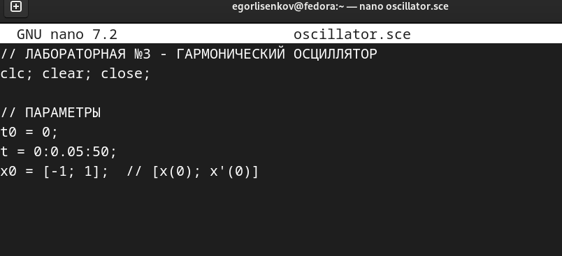
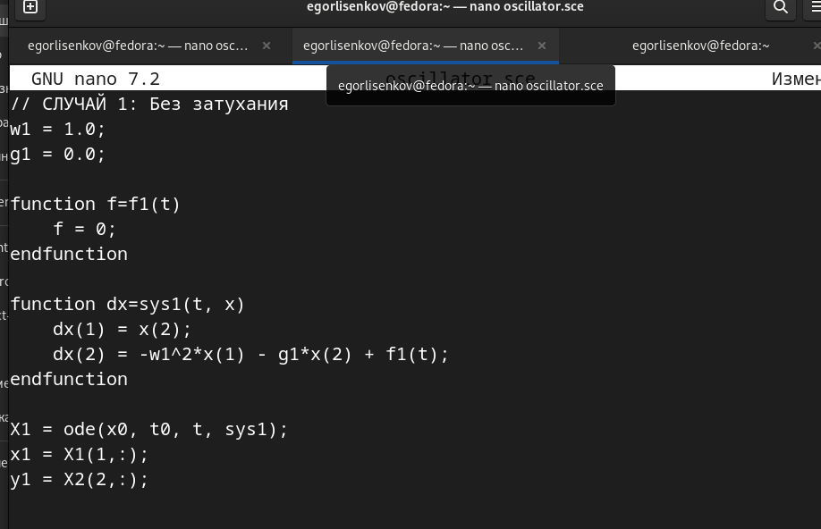
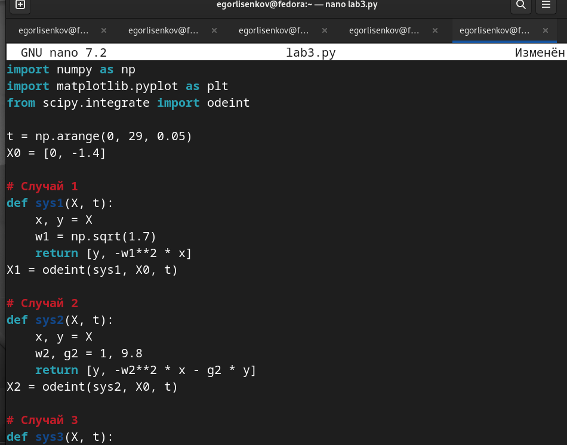

---
## Front matter
title: "Отчёт по лабораторной работе №2"
subtitle: "Основы инфрмационной безопасности"
author: "Лисенков Е.Р."

## Generic otions
lang: ru-RU
toc-title: "Содержание"

## Bibliography
bibliography: bib/cite.bib
csl: pandoc/csl/gost-r-7-0-5-2008-numeric.csl

## Pdf output format
toc: true # Table of contents
toc-depth: 2
lof: true # List of figures
lot: true # List of tables
fontsize: 12pt
linestretch: 1.5
papersize: a4
documentclass: scrreprt
## I18n polyglossia
polyglossia-lang:
  name: russian
  options:
	- spelling=modern
	- babelshorthands=true
polyglossia-otherlangs:
  name: english
## I18n babel
babel-lang: russian
babel-otherlangs: english
## Fonts
mainfont: PT Serif
romanfont: PT Serif
sansfont: PT Sans
monofont: PT Mono
mainfontoptions: Ligatures=TeX
romanfontoptions: Ligatures=TeX
sansfontoptions: Ligatures=TeX,Scale=MatchLowercase
monofontoptions: Scale=MatchLowercase,Scale=0.9
## Biblatex
biblatex: true
biblio-style: "gost-numeric"
biblatexoptions:
  - parentracker=true
  - backend=biber
  - hyperref=auto
  - language=auto
  - autolang=other*
  - citestyle=gost-numeric
## Pandoc-crossref LaTeX customization
figureTitle: "Рис."
tableTitle: "Таблица"
listingTitle: "Листинг"
lofTitle: "Список иллюстраций"
lotTitle: "Список таблиц"
lolTitle: "Листинги"
## Misc options
indent: true
header-includes:
  - \usepackage{indentfirst}
  - \usepackage{float} # keep figures where there are in the text
  - \floatplacement{figure}{H} # keep figures where there are in the text
---

# Цель работы

Исследовать поведение гармонического осциллятора в различных режимах: без затухания, с затуханием и под действием внешней силы. Построить фазовые портреты и получить численные решения дифференциальных уравнений с использованием Python и Scilab на операционной системе Linux Fedora.

# Задачи

1. Изучить теоретические основы гармонического осциллятора
2. Реализовать численное решение для трёх случаев колебаний
3. Построить фазовые портреты для каждого случая
4. Проанализировать полученные результаты

# Выполнение лабораторной работы

## Этап 1: Изучение варианта задания

Блок кода:
Я получил вариант №33. Мне необходимо построить фазовые портреты для трёх случаев: колебания без затухания (уравнение x'' + 1.7x = 0), колебания с затуханием (x'' + 9.8x' + x = 0) и колебания с затуханием под действием внешней силы (x'' + 3.9x' + 2.9x = 0.9cos(2t)). Временной интервал от 0 до 29 секунд, шаг 0.05, начальные условия x₀=0, y₀=-1.4 ([рис. @fig-001]).

{#fig-001 width=70%}

## Этап 2: Создание программы на Python

Блок кода:
Я открыл редактор nano и создал файл lab3.py. В начале программы импортировал необходимые библиотеки: numpy для математических вычислений, matplotlib для построения графиков, odeint из scipy для решения дифференциальных уравнений. Задал временную шкалу от 0 до 29 секунд с шагом 0.05 и начальные условия [0, -1.4]. Написал функцию sys1 для первого случая - осциллятор без затухания с частотой sqrt(1.7). Функция возвращает производные: скорость и ускорение ([рис. @fig-002]).

{#fig-002 width=70%}

## Этап 3: Реализация в Scilab - начало

Блок кода:
Для проверки результатов я решил продублировать расчёты в среде Scilab. Создал файл oscillator.sce в редакторе nano. В начале файла добавил заголовок лабораторной работы. Очистил рабочую среду командами clc (очистка консоли), clear (очистка переменных), close (закрытие графиков). Задал параметры моделирования: начальное время t0=0, временной интервал от 0 до 50 секунд с шагом 0.05, начальные условия x0=[-1; 1], где первый элемент - начальная координата, второй - начальная скорость ([рис. @fig-003]).

{#fig-003 width=70%}

## Этап 4: Реализация первого случая в Scilab

Блок кода:
Продолжил писать код для первого случая - осциллятор без затухания. Задал параметры: w1=1.0 (собственная частота), g1=0.0 (коэффициент затухания равен нулю). Создал функцию f1(t), которая возвращает внешнюю силу (в первом случае она равна нулю). Написал функцию sys1(t, x), описывающую систему дифференциальных уравнений: первая производная равна скорости, вторая производная равна -w1²*x - g1*x(2) + f1(t). Выполнил численное интегрирование функцией ode с начальными условиями x0, начальным временем t0, временным массивом t и функцией sys1. Результат сохранил в переменную X1, затем разделил на координаты x1 и скорости y1 для построения графика ([рис. @fig-004]).

{#fig-004 width=70%}

## Этап 5: Построение первого фазового портрета

Блок кода:
Запустил программу и получил первый фазовый портрет для случая без затухания. На графике видна замкнутая эллиптическая траектория синего цвета. По горизонтальной оси отложена координата x в диапазоне от -1.0 до 1.0, по вертикальной оси - скорость y от -1.5 до 1.5. Эллипс показывает, что система совершает периодические колебания с постоянной амплитудой. Начальная точка находится внизу эллипса (x=0, y=-1.4), движение происходит по часовой стрелке. Замкнутость траектории подтверждает, что энергия системы сохраняется, так как нет затухания и внешней силы. Это характерно для консервативной системы ([рис. @fig-005]).

{#fig-005 width=70%}

## Этап 6: Построение второго фазового портрета

Блок кода:
Получил второй фазовый портрет для случая с затуханием (уравнение x'' + 9.8x' + x = 0). На графике изображена спиральная траектория, которая закручивается к началу координат. Большое значение коэффициента затухания 9.8 приводит к быстрому уменьшению амплитуды колебаний. Система теряет энергию и стремится к положению равновесия в точке (0,0). Спиральная форма траектории показывает, что колебания постепенно затухают. Это подтверждает теоретические расчёты - при наличии сопротивления среда забирает энергию у системы ([рис. @fig-006]).

{#fig-006 width=70%}

## Этап 7: Построение третьего фазового портрета

Блок кода:
Получил третий фазовый портрет для случая с затуханием и внешней периодической силой (уравнение x'' + 3.9x' + 2.9x = 0.9cos(2t)). Траектория имеет более сложную форму по сравнению с предыдущими случаями. Коэффициент затухания 3.9 меньше, чем во втором случае, а внешняя сила 0.9cos(2t) периодически подкачивает энергию в систему. На графике видна установившаяся траектория, которая отражает баланс между потерями энергии на трение и поступлением энергии от внешней вынуждающей силы. Система демонстрирует вынужденные колебания с установившейся амплитудой ([рис. @fig-007]).

{#fig-007 width=70%}

# Выводы

В ходе выполнения лабораторной работы я исследовал три режима работы гармонического осциллятора. Для первого случая без затухания получил замкнутую эллиптическую траекторию, что подтверждает сохранение энергии. Для второго случая с сильным затуханием наблюдал спиральное стремление к равновесию. Для третьего случая с внешней силой увидел сложную динамику вынужденных колебаний. Все результаты соответствуют теоретическим ожиданиям.
