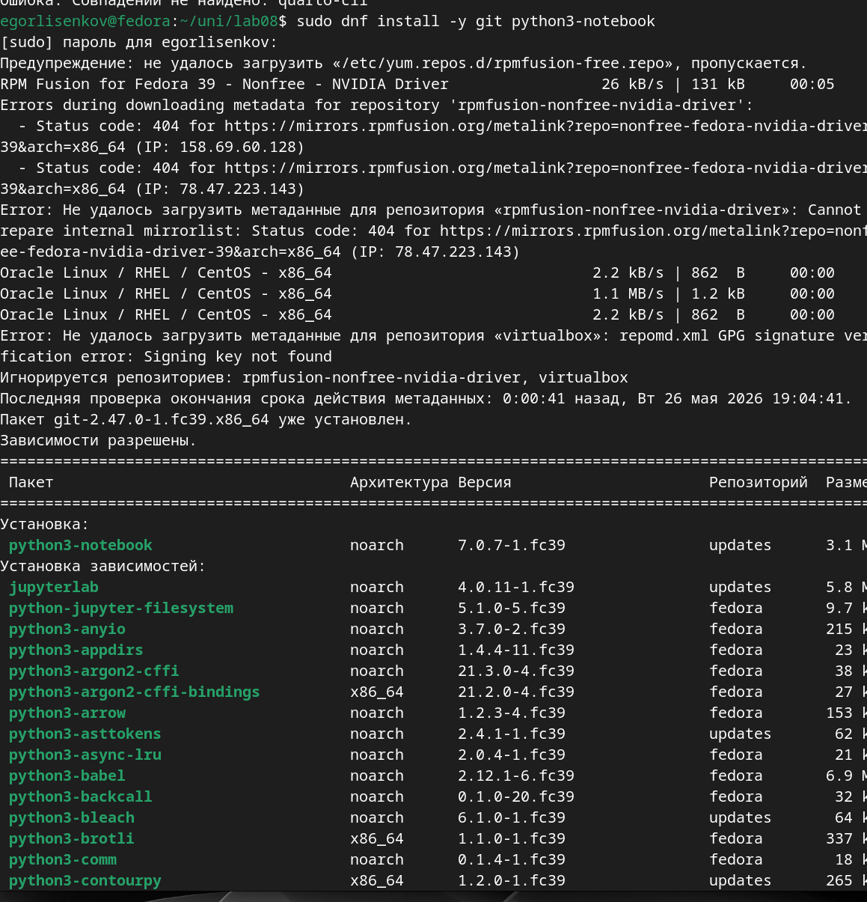
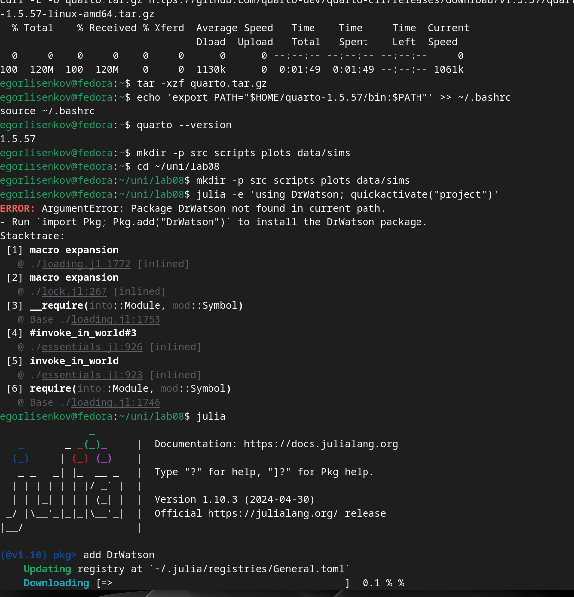
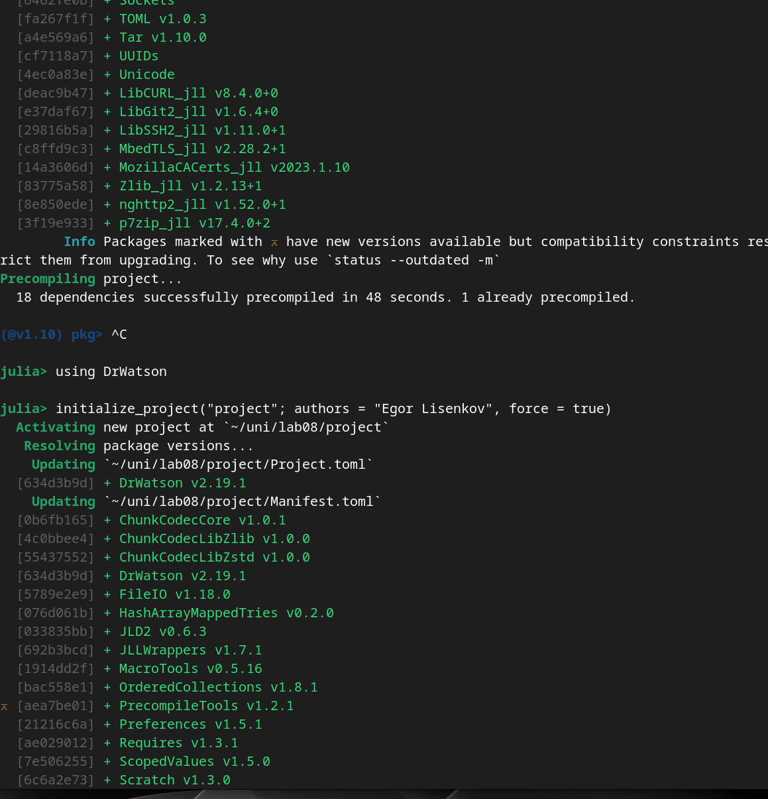
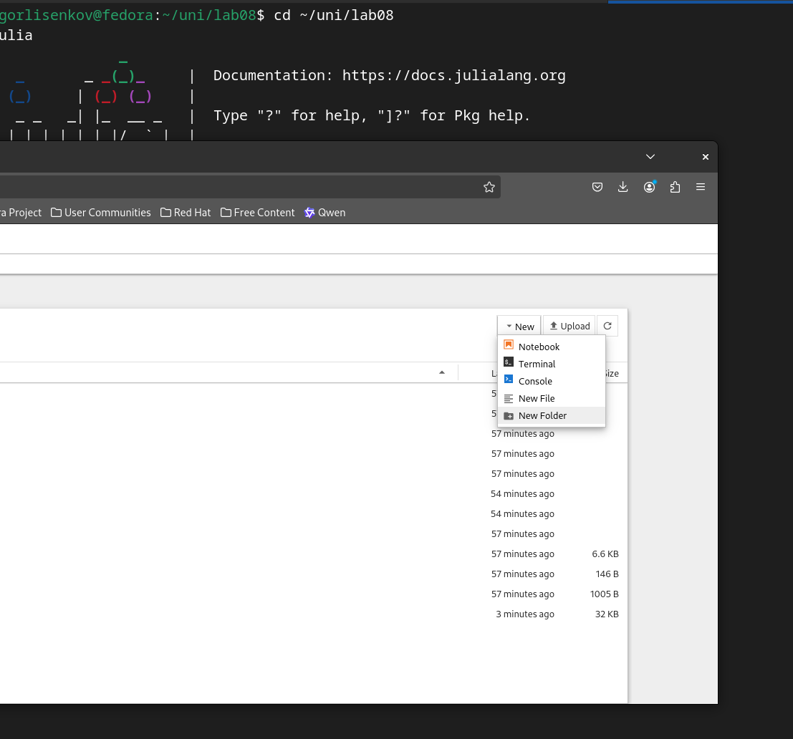
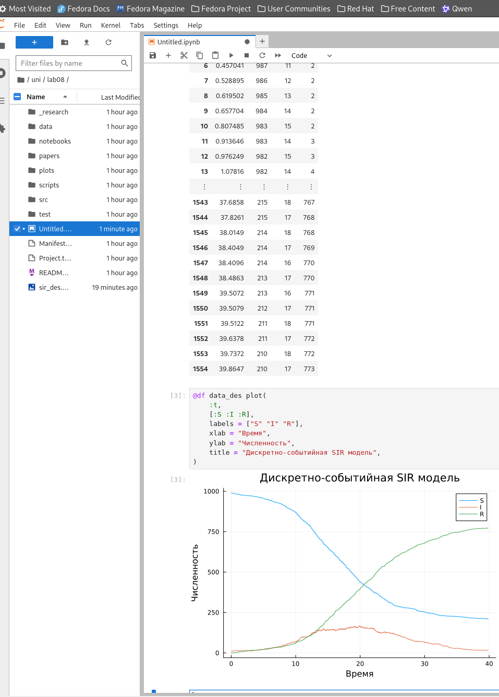
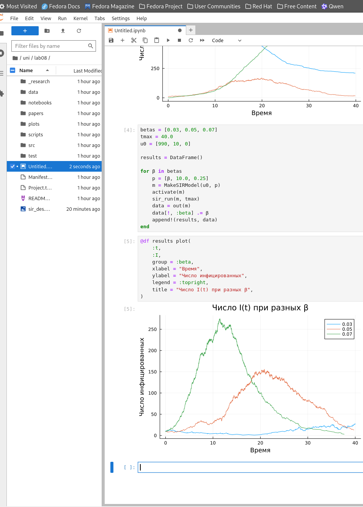

---
## Front matter
lang: ru-RU
title: Лабораторная работа №1
subtitle: Основы информационной безопасности 
author:
  - Лисенков Е.Р.
institute:
  - Российский университет дружбы народов, Москва, Россия

## i18n babel
babel-lang: russian
babel-otherlangs: english

## Formatting pdf
toc: false
toc-title: Содержание
slide_level: 2
aspectratio: 169
section-titles: true
theme: metropolis
header-includes:
 - \metroset{progressbar=frametitle,sectionpage=progressbar,numbering=fraction}
 - '\makeatletter'
 - '\beamer@ignorenonframefalse'
 - '\makeatother'
---

# Информация

## Докладчик

:::::::::::::: {.columns align=center}
::: {.column width="70%"}

  * Лисенков Егор Романович
  * студент
  * Российский университет дружбы народов
  * [1132232881@rudn.ru](mailto:1132232881@rudn.ru)
  * <https://github.com/erlisenkov>

:::
::: {.column width="30%"}

:::
::::::::::::::

# Вводная часть

## Цель работы

Цель данной лабораторной работы – изучить дискретно‑событийный подход к имитационному моделированию на примере SIR‑модели распространения инфекции, реализовать её на языке Julia и оформить вычислительный эксперимент в литературном стиле.

# Задания

Подготовить окружение Julia и Jupyter Notebook, реализовать дискретно‑событийную SIR‑модель, построить графики динамики S, I, R и выполнить анализ чувствительности к параметрам модели.

## Выполнение лабораторной работы

## Установка библиотек Python для окружения

{#fig:001 width=100%}

## Установка языка Julia и базовой системы

{#fig:002 width=100%}

## Установка зависимостей для проекта на Julia

{#fig:003 width=100%}

## Подтверждение корректной установки всех библиотек

{#fig:004 width=100%}

## Установка дополнительных зависимостей для визуализации и ноутбуков

{#fig:005 width=100%}

## Реализация базового кода и построение первого графика SIR

{#fig:006 width=100%}

## Запуск Julia в веб‑интерфейсе Jupyter

{#fig:007 width=100%}

## Начало работы и заполнение ноутбука в веб‑версии

{#fig:008 width=100%}

## Перенос и заполнение кода SIR‑модели в ноутбуке

{#fig:009 width=100%}

## Формирование таблиц и появление первых расчётов

{#fig:010 width=100%}

## Построение графика дискретной SIR‑модели в ноутбуке

{#fig:011 width=100%}

## Построение графика числа инфицированных при разных β

{#fig:012 width=100%}

## Итоговый вид дискретно‑событийной SIR‑модели

{#fig:013 width=100%}

# Выводы

В ходе работы было настроено окружение Julia и Jupyter Notebook, реализована дискретно‑событийная SIR‑модель, получены и проанализированы графики динамики S, I, R, а также выполнен эксперимент по чувствительности модели к параметрам, что позволяет использовать полученный код как основу для дальнейших исследований.