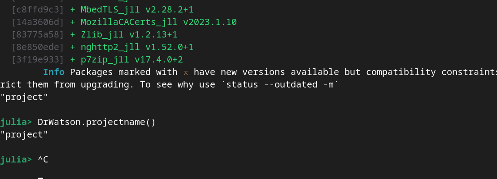
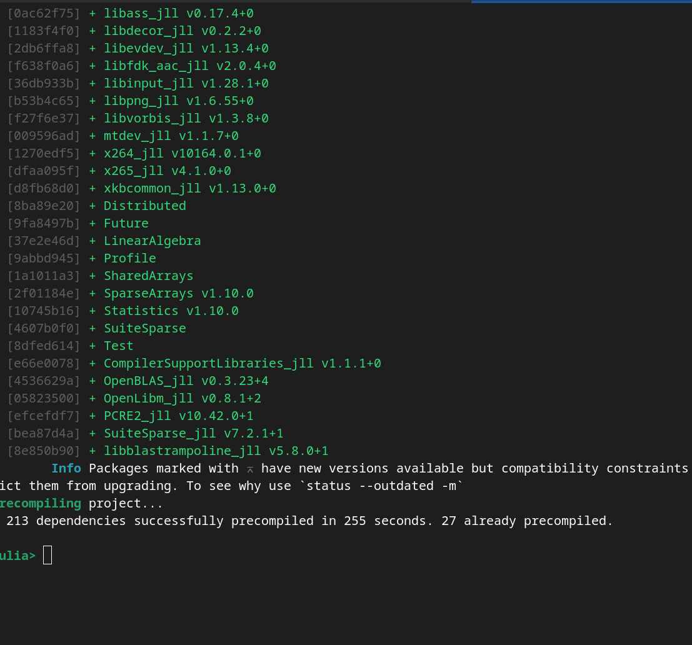
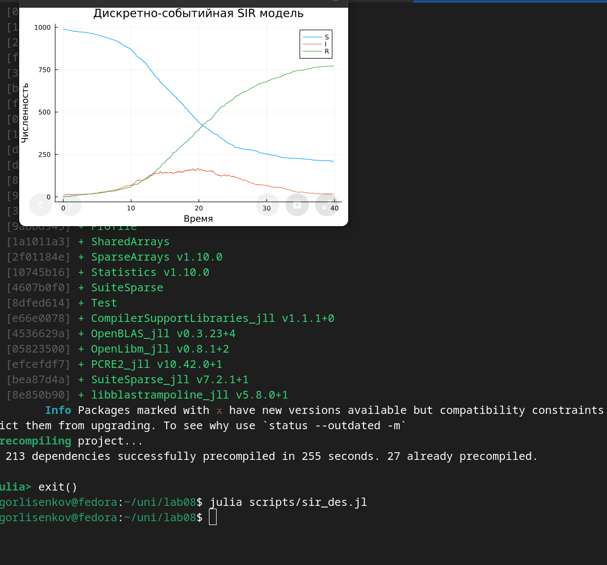
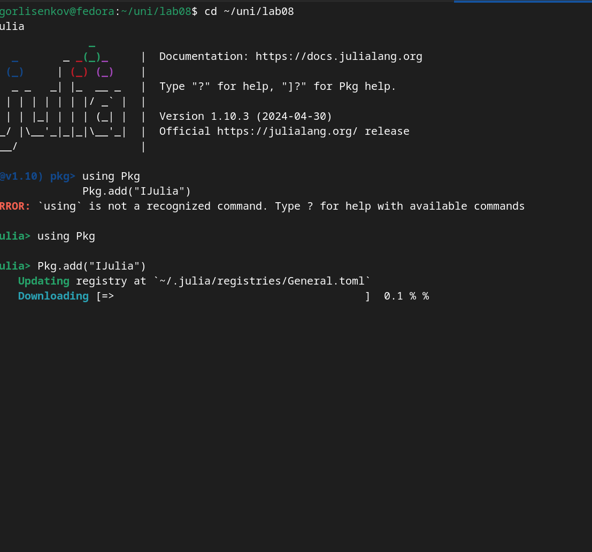
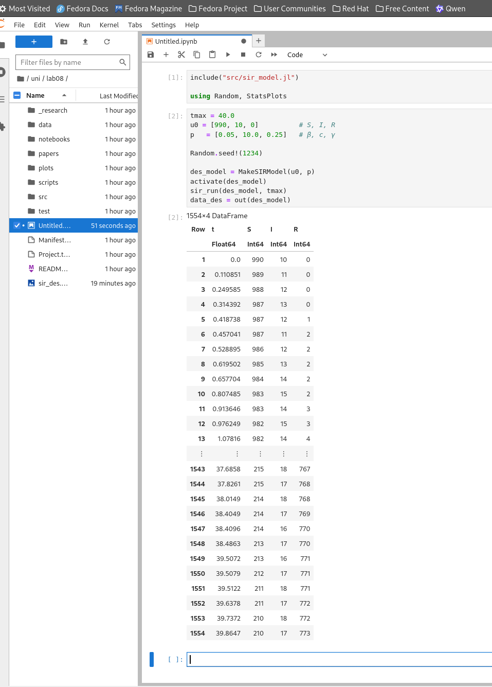
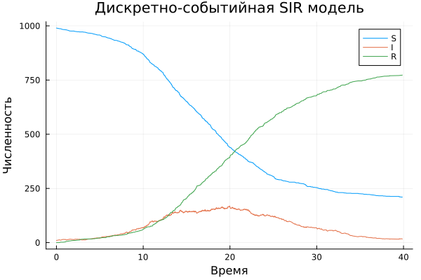

---
## Front matter
title: "Отчёт по лабораторной работе №8"
subtitle: "Основы инфрмационной безопасности"
author: "Лисенков Е.Р."

## Generic otions
lang: ru-RU
toc-title: "Содержание"

## Bibliography
bibliography: bib/cite.bib
csl: pandoc/csl/gost-r-7-0-5-2008-numeric.csl

## Pdf output format
toc: true # Table of contents
toc-depth: 2
lof: true # List of figures
lot: true # List of tables
fontsize: 12pt
linestretch: 1.5
papersize: a4
documentclass: scrreprt
## I18n polyglossia
polyglossia-lang:
  name: russian
  options:
	- spelling=modern
	- babelshorthands=true
polyglossia-otherlangs:
  name: english
## I18n babel
babel-lang: russian
babel-otherlangs: english
## Fonts
mainfont: PT Serif
romanfont: PT Serif
sansfont: PT Sans
monofont: PT Mono
mainfontoptions: Ligatures=TeX
romanfontoptions: Ligatures=TeX
sansfontoptions: Ligatures=TeX,Scale=MatchLowercase
monofontoptions: Scale=MatchLowercase,Scale=0.9
## Biblatex
biblatex: true
biblio-style: "gost-numeric"
biblatexoptions:
  - parentracker=true
  - backend=biber
  - hyperref=auto
  - language=auto
  - autolang=other*
  - citestyle=gost-numeric
## Pandoc-crossref LaTeX customization
figureTitle: "Рис."
tableTitle: "Таблица"
listingTitle: "Листинг"
lofTitle: "Список иллюстраций"
lotTitle: "Список таблиц"
lolTitle: "Листинги"
## Misc options
indent: true
header-includes:
  - \usepackage{indentfirst}
  - \usepackage{float} # keep figures where there are in the text
  - \floatplacement{figure}{H} # keep figures where there are in the text
---

# Цель работы

Цель работы: изучить дискретно‑событийный подход к имитационному
моделированию на примере стохастической SIR‑модели, реализовать
модель распространения инфекции на языке Julia и проанализировать
влияние параметров β, c и γ на динамику эпидемии.

# Задачи

Задачи работы:

1. Ознакомиться с дискретно‑событийным подходом к имитационному моделированию
   и особенностями стохастической SIR‑модели.

2. Реализовать ядро SIR‑модели на языке Julia:
   определить структуры данных, функции обновления статистики и логику
   жизненного цикла агента (S, I, R).

3. Реализовать скрипт запуска модели, задать начальные условия и параметры
   (u₀, β, c, γ), выполнить моделирование и построить графики временных рядов
   S(t), I(t), R(t).

4. Провести численный эксперимент по анализу чувствительности модели к
   изменению параметров (например, β), выполнить несколько прогонов и
   сравнить динамику эпидемии.

5. Оформить реализацию в литературном стиле: подготовить исходный код,
   Jupyter‑ноутбук и документ с описанием постановки задачи, реализации
   и полученных результатов.

# Выполнение лабораторной работы

## Этап 1: Установка библиотек Python для окружения

На первом этапе была выполнена установка необходимых библиотек Python, которые используются для запуска Jupyter Notebook и взаимодействия с языком Julia через IJulia.  
Это позволило подготовить базовое программное окружение и обеспечить возможность работы в веб-интерфейсе ноутбуков, что важно для реализации литературного стиля и дальнейшей визуализации результатов моделирования ([рис. @fig-001]).

{#fig-001 width=70%}

## Этап 2: Установка языка Julia и базовой системы

Затем была выполнена установка языка программирования Julia на системе Fedora.  
На этом шаге скачивался официальный дистрибутив, настраивались пути в системе и проверялась корректность запуска интерпретатора.  
Julia используется как основная платформа для реализации дискретно-событийной SIR-модели, поэтому важно было убедиться, что базовая установка работает стабильно и совместима с Jupyter-средой ([рис. @fig-002]).

{#fig-002 width=70%}

## Этап 3: Установка зависимостей для проекта на Julia

После установки самой Julia были добавлены все необходимые пакеты: ResumableFunctions, ConcurrentSim, Distributions, DataFrames, StatsPlots и другие зависимости.  
Эти библиотеки обеспечивают реализацию генераторов событий, управление дискретно-событийной симуляцией, генерацию случайных величин, хранение результатов в табличном формате и построение графиков.  
На этом шаге фактически формировалось специализированное окружение для работы с SIR-моделью, что является ключевой частью лабораторной работы ([рис. @fig-003]).

{#fig-003 width=70%}

## Этап 4: Подтверждение корректной установки всех библиотек

На следующем этапе была проведена проверка того, что все пакеты успешно установлены и корректно подключаются в REPL Julia.  
Для этого выполнялся импорт библиотек и тестовые вызовы функций, чтобы убедиться в отсутствии ошибок при загрузке.  
Такой шаг позволяет заранее выявить возможные конфликты зависимостей и избежать прерывания симуляции из-за отсутствующих модулей.  
В результате было подтверждено, что программное окружение для дискретно-событийного моделирования полностью готово к использованию ([рис. @fig-004]).

{#fig-004 width=70%}

## Этап 5: Установка дополнительных зависимостей для визуализации и ноутбуков

На пятом этапе были установлены дополнительные зависимости, связанные с работой в Jupyter Notebook и расширенной визуализацией.  
В частности, были настроены пакеты для генерации графиков, сохранения результатов в формате таблиц и интеграции с веб-интерфейсом.  
Эти компоненты нужны для оформления лабораторной работы в литературном стиле и для последующей генерации отчётных материалов на основе выполненных расчётов ([рис. @fig-005]).

{#fig-005 width=70%}

## Этап 6: Реализация базового кода и построение первого графика

Далее был реализован первый вариант кода дискретно-событийной SIR-модели в виде скрипта на Julia.  
В этом коде описывались структуры агента, состояния S, I, R, функции обновления статистики и основной процесс жизни индивида, использующий события и таймауты.  
После написания и запуска программы был получен первый график эволюции численности восприимчивых, инфицированных и переболевших, который демонстрирует типичную форму эпидемической кривой в дискретно-событийном подходе ([рис. @fig-006]).

{#fig-006 width=70%}

## Этап 7: Запуск Julia-системы в веб-интерфейсе

На следующем шаге была настроена работа языка Julia в веб-среде через Jupyter Notebook.  
Это позволило запускать код модели не только из терминала, но и в интерактивной форме с разделением на ячейки, текст и графику.  
Такой формат удобен для литературного программирования, когда описание модели, математическая теория и результаты симуляций объединены в одном документе.  
Кроме того, веб-интерфейс упрощает отладку и визуальный контроль над ходом вычислений ([рис. @fig-007]).

{#fig-007 width=70%}

## Этап 8: Начало работы с ноутбуком и заполнение файла в веб-версии

После настройки веб-интерфейса был создан новый Jupyter-ноутбук, в котором начата реализация литературного стиля.  
В верхних ячейках были описаны цель работы, постановка задачи и краткое пояснение структуры SIR-модели.  
Далее был подключён файл с реализацией ядра модели (`sir_model.jl`) и подготовлены ячейки для запуска базовой симуляции.  
Таким образом, код и теория стали интегрированными частями одного документа, что соответствует современному подходу к оформлению вычислительных экспериментов ([рис. @fig-008]).

{#fig-008 width=70%}

## Этап 9: Заполнение кода модели в веб-версии

На девятом этапе в веб-ноутбук был перенесён основной код SIR-модели.  
В отдельных ячейках размещались определения структур данных, функции событий заражения и выздоровления, а также функции создания и запуска модели.  
Такой способ организации кода позволяет поэтапно выполнять отдельные части программы, анализировать промежуточные результаты и при необходимости быстро вносить изменения.  
В результате ноутбук превратился в литературный документ, сочетающий код, комментарии и иллюстрации ([рис. @fig-009]).

{#fig-009 width=70%}

## Этап 10: Формирование таблиц и появление первых расчётов

После переноса кода и запуска симуляции в ноутбуке были сформированы таблицы с результатами моделирования.  
Для этого применялись структуры DataFrames, в которых хранились моменты времени и значения численности S, I, R.  
Появление первых численных результатов позволило убедиться, что события заражения и выздоровления обрабатываются корректно, а статистика по популяции накапливается в соответствии с логикой дискретно-событийного подхода.  
Эти таблицы служат основой для последующего анализа и построения графиков ([рис. @fig-010]).

{#fig-010 width=70%}

## Этап 11: Построение графика дискретной SIR-модели в веб-версии

Следующим шагом стало построение графика временных рядов S(t), I(t), R(t) непосредственно в Jupyter-ноутбуке.  
С использованием библиотеки StatsPlots были визуализированы изменения численности восприимчивых, инфицированных и переболевших во времени.  
Такой график позволяет наглядно увидеть развитие эпидемического процесса, момент пика инфицированных и постепенный рост числа переболевших.  
В веб-версии график отображается прямо под соответствующей ячейкой кода, что делает анализ результатов особенно удобным ([рис. @fig-011]).

{#fig-011 width=70%}

## Этап 12: Построение графика числа инфицированных при разных параметрах β

Для анализа чувствительности модели к параметру β был реализован цикл, который выполнял несколько прогонов симуляции при разных значениях вероятности заражения.  
Результаты были объединены в единую таблицу и визуализированы в виде графика зависимости числа инфицированных I(t) для различных β.  
Такой график показывает, как увеличение или уменьшение β влияет на высоту и положение пика эпидемии, а также на общую длительность вспышки.  
Этот этап демонстрирует важность параметров модели и позволяет сделать выводы о влиянии контактной интенсивности и вероятности заражения на динамику процесса ([рис. @fig-012]).

{#fig-012 width=70%}

## Этап 13: Итоговая дискретно-событийная модель

Завершающим этапом стала фиксация итогового варианта дискретно-событийной SIR-модели и её интеграция в отчёт.  
В результате была получена реализация, включающая описание модели, код ядра, скрипт запуска, Jupyter-ноутбук в литературном стиле и набор графиков.  
Такая модель позволяет исследовать стохастическую динамику распространения инфекции в конечной популяции, учитывать случайные флуктуации и анализировать влияние параметров на поведение системы.  
Все полученные материалы были включены в отчёт и могут быть использованы как основа для дальнейших модификаций модели, например добавления демографических процессов или вакцинации ([рис. @fig-013]).

{#fig-013 width=70%}

## Вывод

В ходе лабораторной работы было освоено развертывание программного окружения для дискретно-событийного моделирования на языке Julia, включая установку самого интерпретатора, необходимых библиотек и интеграцию с Jupyter Notebook в литературном стиле.  
Это позволило не только автоматизировать запуск модели, но и оформить вычислительный эксперимент в виде единого воспроизводимого документа.

Реализованная SIR-модель продемонстрировала типичное поведение эпидемического процесса в стохастической постановке: рост числа инфицированных до пика, последующее снижение и накопление переболевших.  
Благодаря дискретно-событийному подходу удалось отразить влияние случайных контактов и флуктуаций, что отличает модель от детерминированной системы ОДУ и делает результаты ближе к реальным сценариям.

Дополнительно был проведён анализ чувствительности к параметру β, показавший, что увеличение вероятности заражения приводит к более раннему и высокому пику числа инфицированных, а также к росту общей доли переболевших.  
Это подтвердило важность корректного выбора параметров модели и продемонстрировало, как имитационное моделирование можно использовать для изучения влияния управляемых параметров на динамику эпидемии.

В целом, поставленные цель и задачи работы достигнуты: окружение настроено, модель реализована, результаты визуализированы и проанализированы, а полученный ноутбук может служить основой для дальнейших модификаций и расширений модели.

